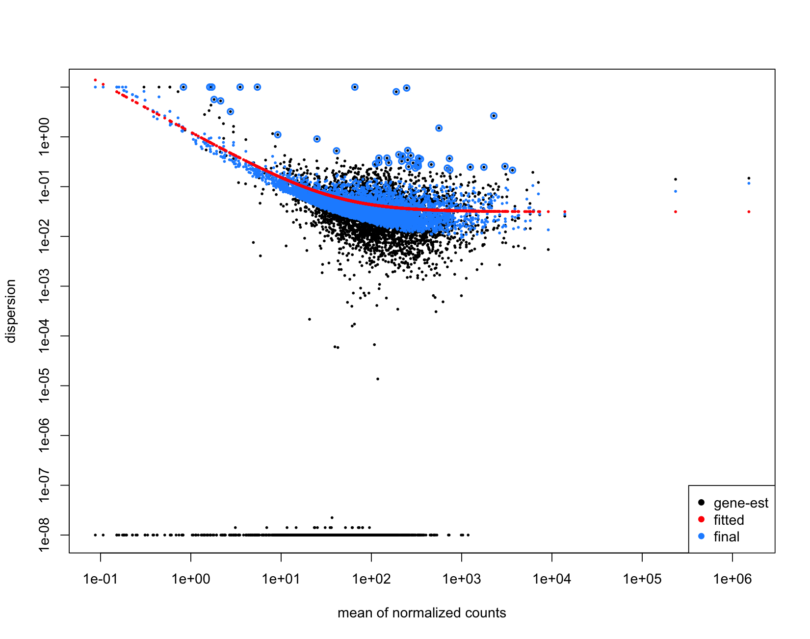
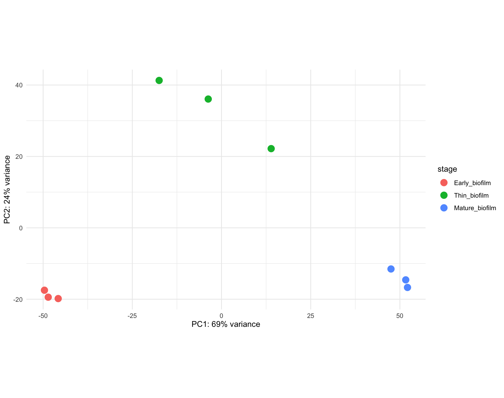
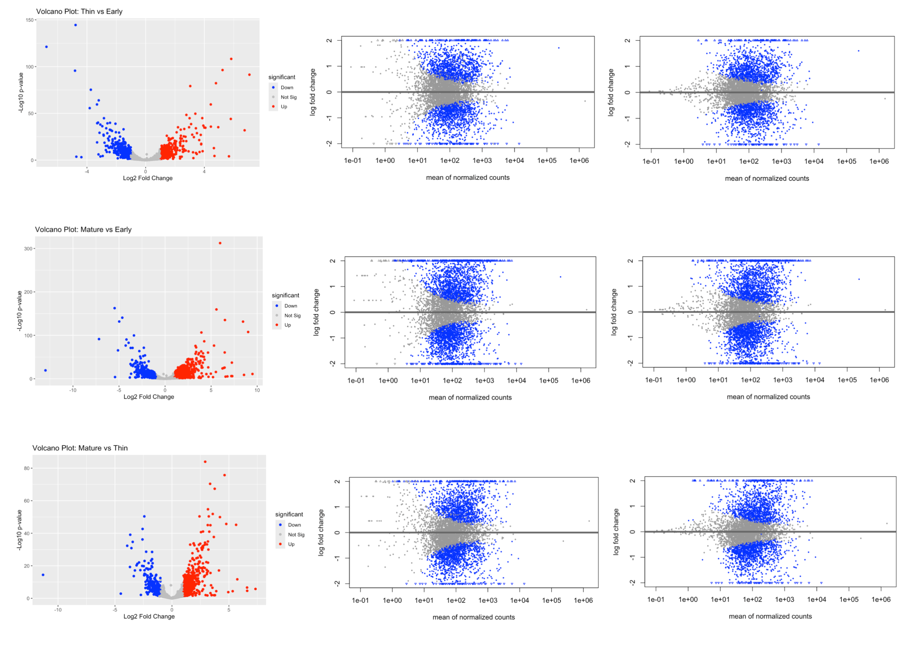
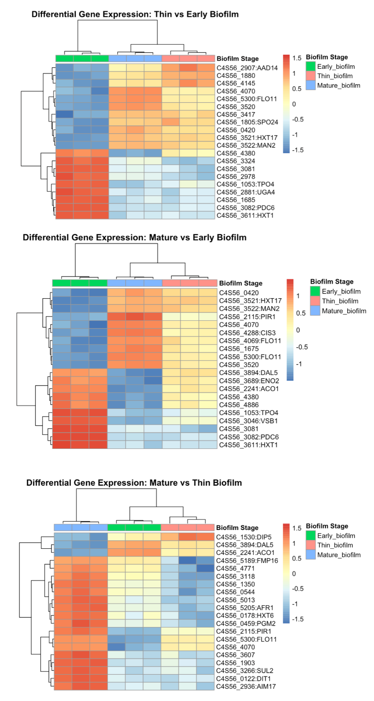
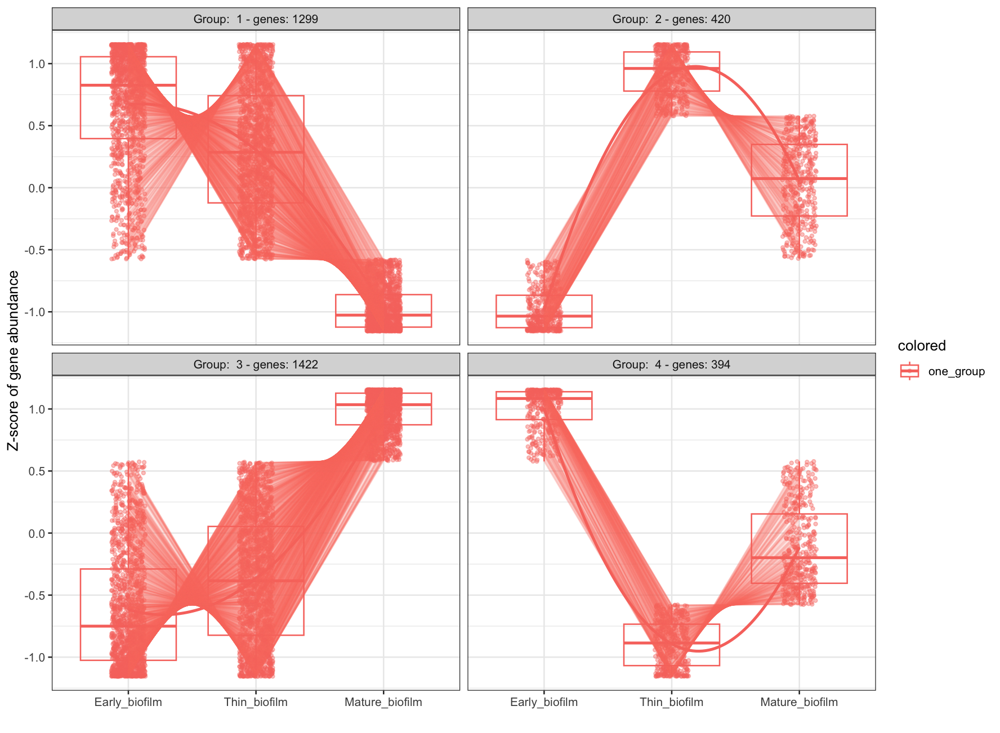
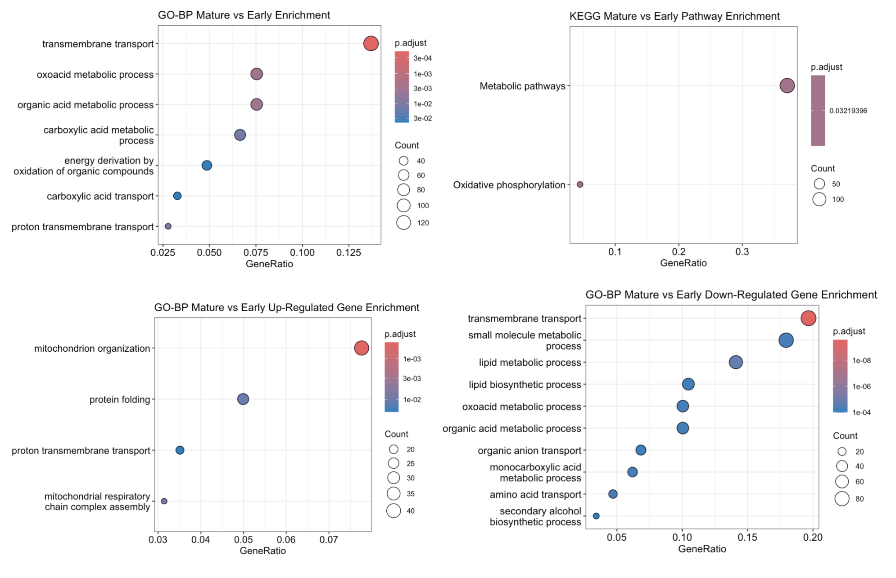
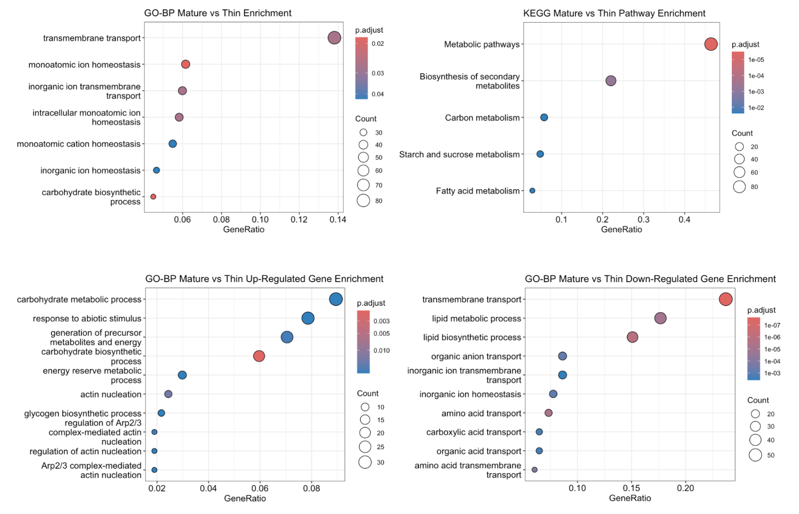
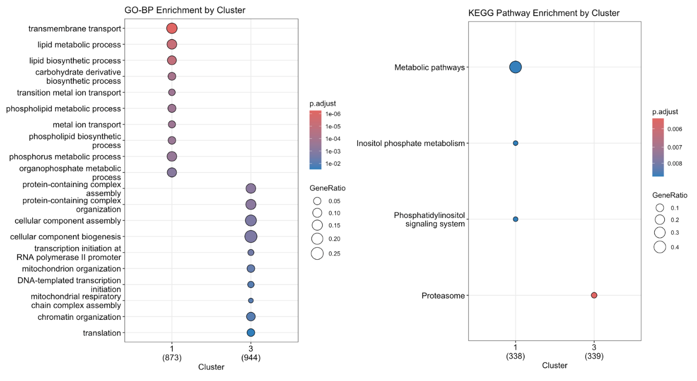

# BINF6110 Assignment 2: Using Bioinformatic Research Tools to Perform Differential Expression Analysis on the Bulk Transcriptome of Saccharomyces cerevisiae strain I-329

## Introduction

Sherry wines, originating from Spain, are distinctive fortified wines produced from the fermentation and maturation of several white grape varieties. [1] Spain is one of the world’s leading wine exporters (19.4%), and the Sherry Wine Region has 63 wineries dedicated solely to sherry production. [2, 3] Wine tourism is a significant economic driver for the country. [2] Research has demonstrated that winery and museum visits on wine tourism routes contribute to boosting regional competitiveness, enhancing residents’ quality of life, promoting environmental sustainability, and supporting wine production activities. [3] Specialized ‘flor’ strains of *Saccharomyces cerevisiae* are fundamental to sherry production, determining both chemical composition and sensory properties through biological aging. [4] Investigating flor yeast biology is therefore essential for understanding the biochemical mechanisms underlying sherry wine production and optimization. 

During biological aging, specialized sherry strains of *Saccharomyces cerevisiae* form surface biofilms, commonly referred to as flor, on the wine. Under high-ethanol concentration conditions and with limited fermentable sugars available, flor yeasts exhibit adaptive mechanisms that promote growth and enhance stress-tolerance. [4] Transcriptome analyses of wine yeasts have revealed distinct gene regulatory responses to changing physiological and biochemical conditions during fermentation [5]. These differential expression patterns are closely associated with phenotypic variation among wine strains. [4]  The *S. cerevisiae* flor yeast strain I-329 was originally isolated from Spanish wine cellars and first described in a 1975 study by N.F. Saenko et al., which examined the scientific and technical aspects of sherry wine production. [6] The strain is preserved in the Magarach Collection of Microorganisms of Winemaking, and subsequent investigations have provided detailed microbiological, biochemical, and physiological characterization [6]. Given its relevance to sherry wine production, availability in yeast repositories, and well-characterized properties, strain I-329 represents a suitable model for transcriptomic analysis of flor yeast gene expression.

Effective transcriptomic analysis relies on accurate quantification of gene expression. Estimating transcript abundance from RNA-seq data relies on bioinformatic quantification algorithms that use either alignment-based (mapping to a reference) or alignment-free (pseudo-mapping) techniques to assign read fragments to transcript isoforms. [7] While alignment-based algorithms map sequencing reads to precise genomic coordinates, they are computationally expensive and exhibit limited scalability as data production increases. [8] Alignment-free algorithms address this limitation by estimating expression levels through transcript abundance calculations rather than resolving read-level genomic structure, reducing computational overhead while maintaining accurate transcript quantification. [8] The lightweight pseudo-mapping model, Salmon, produces scalable, high-quality transcript abundance estimates while simultaneously reducing technical biases commonly affecting transcript quantification. [8] Benchmarking analyses indicate that Salmon achieves superior accuracy, sensitivity, and computational efficiency relative to other popular quantification tools. [8] 

Following transcript abundance estimation, differential expression analysis can be performed to identify genes exhibiting significant changes in expression across stages or conditions. [9] This approach facilitates the detection of genes associated with specific biological pathways, pathological states, or treatment responses, offering insight into regulatory patterns and the molecular mechanisms driving observed phenotypes. [9] The selection of differential gene expression analysis tools depends on the statistical methodology employed, such as parametric versus nonparametric modelling, as well as dataset distributional assumptions. [9] Parametric frameworks are typically preferred for RNA-seq datasets, where expression counts are commonly assumed to follow a negative binomial distribution. [9] DESeq2 is a widely adopted parametric method that models RNA-seq count data using a negative binomial framework while incorporating shrinkage estimation to improve the stability and interpretability of dispersion and fold-change estimates [9]. This statistical framework enables robust and reproducible gene-level inference across diverse experimental designs while emphasizing the magnitude of differential expression rather than mere detection. [10] DESeq2 exhibits improved type-I error control and sensitivity compared with alternative count-based differential expression methods. [10]

Once differentially expressed genes have been identified, pathway enrichment analysis can be applied to evaluate their functional relevance [9]. Pathway enrichment analysis is a computational approach to determine whether specific biological pathways are statistically overrepresented within sets of differentially expressed genes or proteins, aiding interpretation of underlying biological processes and phenotypic associations. [9] Gene Ontology (GO) and KEGG (Kyoto Encyclopedia of Genes and Genomes) are classification systems which provide structured frameworks for gene annotation, function, cellular location and biological process involvement. [11] Organizing genes into functional and pathway-related groups supports broader biological interpretation beyond single-gene analysis. *clusterProfiler* is an R package designed to automate biological term classification and functional enrichment analysis for gene clusters, supporting human, mouse, and yeast species. [12] *clusterProfiler* overcomes manual, time-consuming approaches to functional annotation and enrichment, supports multi-cluster comparison and is integrated with visualization tools for comparative functional interpretation. [12]

This study evaluates a computational pipeline for transcriptomic analysis of *Saccharomyces cerevisiae* flor yeast gene expression using RNA-seq data generated under experimental conditions simulating biological wine aging. This work aims to advance understanding of flor yeast physiology and adaptive evolution while providing a molecular framework for optimizing sherry wine production and guiding future strain improvement strategies.

## Methods
### Sequencing Data Acquisition

Transcriptome analysis of the *S. cerevisiae* flor yeast strain I-329 during biological wine aging and flor maturation was performed using nine RNA samples collected across three sampling points, each with three replicates. RNA extraction, purification, mRNA library preparation, and sequencing were conducted according to the methods described by Mardanov et al. (2020). SRA accession files for the nine samples were retrieved from the NCBI Sequence Read Archive using the SRA Toolkit and converted to FASTQ format. Sequencing quality for each sample was assessed using FastQC, which generated summary metrics including per-base sequence quality, GC content, sequence duplication levels, and potential adapter contamination. FastQC output reports were aggregated into a dataframe using the *fastqcr* R package and summarized for analysis. 

### Transcript Abundance Estimates 

A Salmon reference index was generated using the NCBI genome assembly ASM304674v transcriptome fasta for S. cerevisiae strain I-329. Using a FASTA-formatted reference transcriptome, Salmon can quickly infer the probable origin and orientation of sequencing reads, supporting reliable mapping and transcript abundance estimation. Transcript abundance estimations for each sample were quantified using Salmon quasi-mapping mode against the pre-built Salmon index (-i salmon_index). Library type was automatically inferred (-l A), allowing Salmon to detect read orientation without prior specification. Single-end reads were supplied using the -r option, and quantification results for each sample were written to separate output directories. Salmon-based analysis enabled rapid, alignment-free estimation of transcript-level expression while correcting for sequence-specific and GC-content biases inherent to RNA-seq data. [8]

### Differential Gene Expression Analysis

Transcript abundance estimates were imported into R using the *tximport* package. Transcript-level quantifications generated by Salmon were summarized into gene-level count and abundance matrices for downstream differential gene expression analysis. Differential expression analysis was performed using DESeq2, which models RNA-seq count data using a negative binomial generalized linear model. [9] Statistical significance for pairwise comparisons was assessed using the Wald test. Raw gene counts were extracted to calculate the number of genes with detectable expression. Dispersion was visualized using the plotDispEsts() function to examine the mean-variance expression relationship. Principal component analysis (PCA) was performed on variance-stabilized expression values to evaluate global sample variance and assess replicate consistency across biofilm stages

Shrinkage estimation was applied to improve the stability and interpretability of dispersion and log2 fold-change estimates. Gene-level statistical inference was conducted across sample stages. Differential expression results from each pairwise comparison were extracted and filtered using an adjusted p-value threshold (padj < 0.05). Log2 fold-change shrinkage was applied using the ‘apeglm’ method before downstream interpretation. Genes meeting the significance criteria (padj < 0.05 and |log2 fold change| > 1) were classified as upregulated, downregulated, or not significant for visualization. MA plots, volcano plots and heatmaps were used for visual representation of differential gene expression. 

A likelihood ratio test (LRT) implemented in DESeq2 was used to identify genes exhibiting significant expression variation across biological wine aging stages. Genes meeting the significance threshold (padj < 0.05) were retained for downstream analysis. Variance-stabilized expression values were then used as input to the degPatterns() function from the *DEGreport* package to cluster genes via shared expression patterns across stages. Cluster-specific gene expression trajectories were plotted for pattern visualization. 

### Functional Analysis

The NCBI ASM304674v transcriptome FASTA for *Saccharomyces cerevisiae* strain I-329 was annotated using strain-specific locus tags and protein identifiers, which are not directly compatible with established functional annotation classification systems indexed using standardized reference gene identifiers. To enable downstream functional analyses, translated coding sequences were mapped to reference gene identifiers via sequence similarity. Protein sequences derived from the strain I-329 transcriptome were aligned against the *S. cerevisiae* S288C reference proteome using BLASTP to identify putative orthologs.

The *S. cerevisiae* strain S288C, as the first yeast strain to have its genome sequenced, serves as the basis reference genome for yeast gene nomenclature and functional annotation systems. [14] Gene Ontology (GO) and KEGG (Kyoto Encyclopedia of Genes and Genomes) gene entries are indexed using identifiers derived from the NCBI yeast reference genome corresponding to strain S288C. 

Functional annotation and enrichment analyses were performed using Over-Representation Analysis (ORA) implemented in the R package clusterProfiler using the Gene Ontology (GO) and KEGG (Kyoto Encyclopedia of Genes and Genomes) classification systems. Enrichment analyses were conducted on differentially expressed genes identified from DESeq2 stage-specific pairwise comparisons, as well as on cluster-specific gene expression trajectories derived from the DESeq2 likelihood ratio test (LRT) analysis. Pairwise enrichment analyses were used to examine stage-specific biological differences and the mechanistic processes associated with stage-discrete transitions. In addition, enrichment analyses of LRT-derived clusters were performed to understand expression trajectories across stages, providing a systems-level interpretation of gene expression dynamics across biological wine aging. 

## Results

### Sequencing Data Quality and Characteristics

FastQC analysis showed that a total of 64,248,629 Illumina reads were generated across all samples, each with a read length of 50 bp. In total, this corresponded to 3.21 Gbp of sequence data, with an average GC content of 44.44%. FastQC quality assessment indicated high per-base sequence quality and no adapter contamination across all samples. Expected RNA-seq-specific biases were observed in analysis results, including non-uniform per-base sequence composition and elevated duplication levels, consistent with transcript abundance effects rather than technical artifacts. [15]

### Global Expression Assessment 

To provide a foundational context for differential expression analyses between stages, global expression characteristics were assessed. 5,395 total genes were identified in the dataset; 5,384 genes exhibited detectable expression (counts > 0 in at least one sample). Examination of the mean-variance expression relationship demonstrated a negative mean–dispersion relationship. Dispersion estimates closely followed the fitted trend (red line), indicating appropriate variance modelling and stable replicate variability without evidence of excessive dispersion or sample heterogeneity (Figure 1)

  

  <small>
    <b>Figure 1. Mean–Dispersion Relationship Estimated by DESeq2. </b> Dispersion estimates are shown as a function of the mean of normalized counts (log scale). Black points represent gene-wise dispersion estimates, the red curve indicates the fitted dispersion–mean trend, and blue points show the final shrinkage-adjusted dispersion estimates used for differential expression testing. The observed inverse mean-variance relationship is consistent with expectations for RNA-seq data, with higher dispersion at low expression levels and stabilization at higher counts. The close agreement between gene-wise estimates and the fitted trend indicates appropriate dispersion modelling and stable replicate variability across samples.
  </small>

To determine whether overall transcriptional variation reflected stage-specific differences, principal component analysis (PCA) was conducted using variance-stabilized expression values. PCA revealed clear stage-dependent transcriptomic separation (Figure 2). The first principal component (PC1) explained 69% of the total variance and separated early and mature biofilm samples, while the second principal component (PC2), accounting for 24% of the variance, distinguished the thin biofilm stage. Replicates are clustered tightly within each stage, indicating high within-group consistency and strong biological structuring of global gene expression patterns across biofilm maturation.

  

  <small>
    <b>Figure 2. Principal Component Analysis of Transcriptomic Variation across Biofilm Stages. </b> PCA was performed on variance-stabilized gene expression values. PC1 (69% of total variance) separated early and mature biofilm samples, while PC2 (24%) distinguished the thin biofilm stage. Each point represents an individual sample, colored by stage. Tight clustering of replicates within stages indicates strong biological consistency and stage-dependent transcriptional structuring.
  </small>

### Stage-Specific Differential Gene Expression During Biological Wine Aging

Differential gene expression pairwise comparisons assessed using the Wald test revealed extensive stage-dependent transcriptional reprogramming during biofilm maturation. Comparison of Thin versus Early biofilm stages revealed that 1012 genes demonstrated significant differential expression (padj < 0.05, |log2FC| > 1).  In comparison, 1704 genes were significantly differently expressed between the Mature versus Early biofilm stages, and 1147 genes between the Mature versus Thin biofilm stages. 

MA plots for each pairwise comparison, shown for both raw and ‘apeglm’ shrinkage-adjusted fold changes, showed balanced fold-change distributions and consistent variance patterns, indicating that the differential expression analysis was well modelled. (Figure 3). The Mature versus Early comparison exhibited the greatest magnitude and number of differentially expressed genes, consistent with notable transcriptional divergence/changes between early and mature stages. In comparison, the Mature versus Thin analysis showed fewer genes and generally smaller fold changes, supporting the interpretation of the thin biofilm stage as a transitional transcriptional state (Figure 3).

  

  <small>
    <b>Figure 3. Differential gene expression across biofilm maturation stages.  </b> Volcano plots (left) and MA plots (right) display pairwise differential expression comparisons between Thin vs Early, Mature vs Early, and Mature vs Thin biofilms. Volcano plots show log2 fold change versus −log10 adjusted p-value, with significantly upregulated genes indicated in red and downregulated genes in blue (padj < 0.05, |log2FC| > 1). MA plots (middle) depict log2 fold change as a function of mean normalized counts, highlighting significantly differentially expressed genes (blue) relative to non-significant genes (gray). MA plots (right) show log2fold change using the ‘apeglm’ method to stabilize shrinkage. Collectively, these comparisons reveal extensive stage-dependent transcriptional reprogramming during biofilm maturation.
  </small>

The top 20 most significantly differentially expressed genes (adjusted p-value < 0.05) for each pairwise comparison were extracted, variance-stabilized, and scaled by gene to identify expression patterns across biofilm stages (Figure 4). Given the NCBI transcriptome FASTA for *Saccharomyces cerevisiae* strain I-329 was annotated using strain-specific locus tags and protein identifiers, protein sequences derived from the I-329 transcriptome were aligned against the *S. cerevisiae* S288C reference proteome using BLASTP to identify putative ortholog gene identifiers. BLAST-mapped gene names, where available, were displayed alongside strain I-329 locus tags to facilitate biological interpretation using commonly annotated yeast gene homologs. All three heatmaps demonstrate tight clustering of biological replicates and clear separation by biofilm stage, supporting the robustness and reliability of the DESeq2 differential expression analysis. 

Thin and Mature biofilm samples formed distinct clusters relative to Early biofilm, indicating extensive transcriptional reprogramming during biofilm formation and maturation. Genes associated with adhesion and cell surface remodelling (e.g., *FLO11*, *PIR1*) and carbohydrate transport (e.g., *HXT17*) displayed stage-dependent expression patterns, while metabolic genes like *PDC6* and *HXT1* were preferentially expressed in Early biofilms (Figure 4). The stage-dependent and inversely regulated expression patterns observed across comparisons suggest coordinated metabolic and structural adaptation during biofilm maturation.

  

  <small>
    <b>Figure 4. Stage-Specific Differential Gene Expression during Flor Biofilm Development in Saccharomyces cerevisiae Strain I-329. </b> Heatmaps display the top 20 most significantly differentially expressed genes (adjusted p-value < 0.05) identified by DESeq2 for each pairwise comparison: Thin vs Early biofilm (top), Mature vs Early biofilm (middle), and Mature vs Thin biofilm (bottom). Rows represent genes (strain locus tags shown, with mapped punitive ortholog gene names where available), and columns represent biological replicates grouped by biofilm stage (Early, Thin, Mature). Expression values correspond to variance-stabilized counts scaled by gene (row z-scores). Red indicates relatively higher expression and blue indicates relatively lower expression across samples for each gene. Hierarchical clustering was performed using Euclidean distance to group genes and samples according to expression similarity.
  </small>

### Clustering Reveals Coordinated Gene Expression Trajectories Across Maturation

A subsequent DESeq2 LRT time-course analysis was used to identify genes demonstrating expression changes across the three biofilm stages. Genes showing significant differential expression (adjusted p-value < 0.05) were subset and variance-stabilized for further analysis. The degPatterns() function from the *DEGreport* package was then used to cluster genes exhibiting similar expression trajectories across stages. 

Four unique cluster expression trajectories were identified (Figure 5). Cluster 1 (1,299 genes) exhibited elevated expression in the Early and Thin biofilm stages, followed by a marked reduction in expression during the Mature stage. Cluster 2 (420 genes) showed low expression in the Early stage, peak expression in the Thin stage, and reduced expression in the Mature stage. Cluster 3 (1,422 genes) demonstrated low expression in both the Early and Thin stages, followed by pronounced upregulation in the Mature stage. Cluster 4 (394 genes) displayed high expression in the Early stage, substantial downregulation in the Thin stage, and partial recovery or modest expression in the Mature stage.

  

  <small>
    <b>Figure 5. Clustering of Stage-Dependent Gene Expression Trajectories across Biofilm Development. </b> Genes exhibiting significant differential expression across the three biofilm stages (adjusted p-value < 0.05, DESeq2 likelihood ratio test) were variance-stabilized and grouped according to shared expression patterns using the degPatterns() function from the DEGreport package. Four distinct expression clusters were identified. Each panel represents one cluster, with the number of genes indicated above. Points represent individual genes, and boxplots summarize the distribution of Z-scored expression values at each stage (Early, Thin, and Mature biofilm). Lines connect gene-level expression profiles across stages, illustrating coordinated temporal expression dynamics during biofilm development.
  </small>

### Functional Enrichment of Stage-Specific Differentially Expressed Genes

Gene Ontology (GO) and KEGG (Kyoto Encyclopedia of Genes and Genomes) gene entries are indexed using identifiers derived from the NCBI yeast reference genome corresponding to strain S288C. As strain I-329 locus tags and protein IDs are incompatible with the GO and KEGG classification systems, BLASTP-mapped putative ortholog IDs were used for functional annotation and enrichment. A total of 3,586 locus IDs mapped to *S. cerevisiae* S288C gene identifiers. 

Stage-specific genes demonstrating significant differential expression (adjusted p-value < 0.05, |log₂FC| > 1) were extracted for each pairwise comparison and merged with the BLAST annotation map to obtain common yeast ORF names alongside strain I-329 locus tag identifiers. Functional enrichment analysis was performed using the *clusterProfiler* package, using the enrichGO() and enrichKEGG() functions to identify overrepresented biological processes, molecular functions, and metabolic pathways within each differentially expressed gene set.

#### Thin vs Early Biofilm

Functional enrichment analysis of genes differentially expressed between Thin and Early biofilms revealed significant overrepresentation of metabolic and respiratory processes. GO biological process enrichment identified terms associated with small-molecule metabolism, carbohydrate metabolism, organic acid metabolism, and energy derivation by oxidation of organic compounds. Transmembrane transport and proton transmembrane transport were also significantly enriched (Figure 6) KEGG pathway analysis further supported these findings, with enrichment of metabolic pathways, carbon metabolism, glycolysis/gluconeogenesis, oxidative phosphorylation, and fatty acid metabolism (Figure 6)

Stratification by expression direction demonstrated that genes upregulated in the Thin stage were enriched for cellular respiration, proton transmembrane transport, mitochondrial membrane organization, and sulphur amino acid biosynthesis. Conversely, downregulated genes were enriched for cell wall organization, carbohydrate metabolic processes, and alcohol biosynthetic processes (Figure 6). These results indicate substantial metabolic and respiratory reprogramming during Thin biofilm establishment.

#### Mature vs Early Biofilm

Comparison of Mature and Early biofilms demonstrated significant enrichment of metabolic and transport-associated processes. GO enrichment analysis identified transmembrane transport, organic acid metabolic processes, carboxylic acid metabolism, and energy derivation by oxidation of organic compounds as overrepresented categories. KEGG pathway analysis highlighted enrichment of metabolic pathways and oxidative phosphorylation (Figure 7).

Genes upregulated in Mature biofilms were enriched for mitochondrial organization, protein folding, proton transmembrane transport, and mitochondrial respiratory chain complex assembly. In contrast, downregulated genes were enriched for lipid metabolic processes, amino acid transport, organic acid transport, and transmembrane transport (Figure 7). Together, these findings reflect extensive metabolic and mitochondrial remodelling during biofilm maturation relative to the Early stage.

#### Mature vs Thin Biofilm

Enrichment analysis of genes differentially expressed between Mature and Thin biofilms revealed continued shifts in transport and metabolic regulation. GO enrichment of all differentially expressed genes identified transmembrane transport, ion homeostasis, inorganic ion transport, and carbohydrate biosynthetic processes as significantly enriched. KEGG pathway analysis demonstrated enrichment of metabolic pathways, biosynthesis of secondary metabolites, carbon metabolism, and starch/sucrose metabolism (Figure 8).

Genes upregulated in Mature biofilms were enriched for carbohydrate metabolic and biosynthetic processes, energy reserve metabolism, response to abiotic stimulus, and actin nucleation-related processes. Downregulated genes were enriched for lipid metabolic processes, amino acid transport, organic acid transport, and transmembrane transport (Figure 8). These patterns indicate ongoing metabolic adjustment and selective modulation of transport and structural pathways during the transition from Thin to Mature biofilms.

  

  <small>
    <b>Figure 6. Functional enrichment analysis of differentially expressed genes in Thin versus Early biofilm stages. </b> Gene Ontology Biological Process (GO-BP) and KEGG pathway enrichment analyses were performed using the clusterProfiler package on genes significantly differentially expressed between Thin and Early biofilms (adjusted p-value < 0.05, |log₂FC| > 1). The top 10 enriched GO biological processes and KEGG pathways are shown. Separate analyses were conducted for all differentially expressed genes (top panels) and for upregulated and downregulated gene subsets (bottom panels). Dot size represents the number of genes associated with each term (gene count), and colour indicates adjusted p-value (Benjamini–Hochberg correction). The x-axis represents gene ratio (the proportion of input genes associated with each enriched term). Enriched categories highlight metabolic reprogramming, respiratory processes, transmembrane transport, and cell wall organization associated with Thin biofilm development.
  </small>

  

  <small>
    <b>Figure 7. Functional enrichment analysis of genes differentially expressed between Mature and Early biofilm stages.  </b> Gene Ontology Biological Process (GO-BP) and KEGG pathway enrichment analyses were performed using clusterProfiler on genes significantly differentially expressed between Mature and Early biofilms (adjusted p-value < 0.05, |log₂FC| > 1). The top enriched GO biological processes and KEGG pathways are shown. Separate analyses were conducted for all differentially expressed genes (top panels) and for upregulated and downregulated gene subsets (bottom panels). Dot size represents gene count, and colour indicates adjusted p-value (Benjamini–Hochberg correction). The x-axis shows gene ratio (proportion of input genes associated with each enriched term). Enriched categories highlight metabolic processes, transmembrane transport, mitochondrial organization, and oxidative phosphorylation, indicating substantial metabolic and respiratory remodelling during biofilm maturation.
  </small>

  

  <small>
    <b>Figure 8. Functional enrichment analysis of genes differentially expressed between Mature and Thin biofilm stages. </b> Gene Ontology Biological Process (GO-BP) and KEGG pathway enrichment analyses were performed using the clusterProfiler package on genes significantly differentially expressed between Mature and Thin biofilms (adjusted p-value < 0.05, |log₂FC| > 1). The top enriched GO biological processes and KEGG pathways are displayed. Separate analyses were conducted for all differentially expressed genes (top panels) and for upregulated and downregulated gene subsets (bottom panels). Dot size represents gene count, and colour indicates adjusted p-value following Benjamini–Hochberg correction. The x-axis shows gene ratio (proportion of input genes associated with each enriched term). Enriched categories highlight alterations in transmembrane transport, ion homeostasis, lipid and carbohydrate metabolism, and secondary metabolite biosynthesis, reflecting continued metabolic and cellular remodelling during biofilm maturation.
  </small>

### Systems-Level Functional Programs Underlying Flor Biofilm Maturation

To further characterize coordinated transcriptional programs across biofilm development, GO and KEGG enrichment analyses were performed on LRT-derived gene clusters grouped via shared expression trajectories.

Clusters 2 and 4 did not exhibit significant enrichment for any GO biological process terms or KEGG pathways.

Cluster 1 (n = 873 genes) was significantly enriched for transmembrane transport, lipid metabolic processes, lipid biosynthetic processes, carbohydrate derivative biosynthesis, transition metal ion transport, phospholipid metabolism, and organophosphate metabolic processes (Figure 9). These enrichments indicate a strong representation of membrane-associated transport functions and lipid metabolic pathways within this cluster. KEGG pathway analysis further demonstrated enrichment for metabolic pathways, inositol phosphate metabolism, and the phosphatidylinositol signalling system, supporting involvement in membrane lipid metabolism and signalling processes (Figure 9).

Cluster 3 (n = 944 genes) showed significant enrichment for protein-containing complex assembly and organization, cellular component assembly and biogenesis, transcription initiation at RNA polymerase II promoters, DNA-templated transcription initiation, mitochondrial organization, mitochondrial respiratory chain complex assembly, chromatin organization, and translation (Figure 9). These enriched terms reflect coordinated regulation of mitochondrial function, transcriptional control, protein synthesis, and higher-order cellular organization. KEGG enrichment analysis of Cluster 3 identified significant enrichment of the proteasome pathway, indicating coordinated regulation of protein degradation machinery within this gene set (Figure 9).

  

  <small>
    <b>Figure 9. Functional enrichment of LRT-derived gene expression clusters during flor biofilm development. </b> Gene Ontology Biological Process (GO-BP) and KEGG pathway enrichment analyses were performed on genes grouped into expression trajectory clusters identified by DESeq2 likelihood ratio test (LRT) analysis and clustering. Clusters 1 (n = 873 genes) and 3 (n = 944 genes) exhibited significant enrichment for distinct functional categories, whereas clusters 2 and 4 showed no significant GO or KEGG enrichment. For GO analysis (left panel), dot size represents gene ratio (proportion of cluster genes associated with each term), and color indicates adjusted p-value (Benjamini–Hochberg correction). Cluster 1 was enriched for transmembrane transport and lipid metabolic processes, while Cluster 3 was enriched for mitochondrial organization, transcriptional regulation, protein complex assembly, and translation. For KEGG pathway analysis (right panel), dot size represents gene ratio and color indicates adjusted p-value. Cluster 1 showed enrichment for metabolic pathways, inositol phosphate metabolism, and phosphatidylinositol signaling, whereas Cluster 3 was enriched for the proteasome pathway. These results demonstrate that distinct transcriptional trajectories correspond to functionally coherent biological programs underlying flor biofilm maturation.
  </small>

## Discussion

Understanding the biochemical mechanisms underlying flor yeast biology is essential for optimizing sherry wine production. In this study, transcriptomic profiling of *Saccharomyces cerevisiae* flor yeast strain I-329 across Early, Thin, and Mature biofilm stages revealed pronounced stage-dependent transcriptional reprogramming. Differential expression analysis identified substantial divergence between Early and Mature biofilms, with inter-stage comparisons demonstrating coordinated and inversely regulated expression patterns. Functional enrichment and LRT time-course analyses further revealed distinct gene expression trajectories associated with metabolic and transport processes during Early-stage wine aging, and mitochondrial organization, translation, and proteasome activity during Mature-stage biofilm development. Collectively, these findings indicate progressive metabolic specialization and structural adaptation as flor biofilms mature.

The stage-dependent transcriptional reprogramming observed, shifting from membrane restructuring and signalling adaptation to enhanced stress tolerance and metabolic and respiratory remodelling, is consistent with established behaviours and adaptations of *Saccharomyces cerevisiae* flor yeasts during Sherry wine biological aging. Transcriptional patterns identified in the differential gene expression analysis support previous research on yeast flor specific genes. Notably, *PDC6* and *HXT1* were preferentially expressed in Early biofilms. *PDC6* encodes a pyruvate decarboxylase involved in aromatic acid catabolism and ethanol production via the Ehrlich pathway, a key metabolic process during early wine fermentation that contributes to alcohol content and aroma development [16,17]. Similarly, *HXT1* encodes a low-affinity glucose transporter that is expressed under high-glucose conditions, facilitating glucose uptake and ATP production during early fermentation stages [18].

In contrast, genes associated with adhesion and biofilm stabilization, like *FLO11*, exhibited expression patterns characteristic of Mature biofilm formation. *FLO11* encodes a hydrophobic cell-surface flocculin that promotes cell aggregation, buoyancy, and biofilm development [19]. Upregulation of *FLO11* during the Mature stage aligns with the formation of the air–liquid interface biofilm characteristic of biological wine aging, where enhanced adhesion and stress resistance support sustained oxidative metabolism [19]. Together, these gene-level observations reinforce the broader enrichment patterns observed in this study and support a progressive shift from fermentative metabolism toward structural stabilization and respiratory specialization during flor maturation. The lack of significant GO or KEGG enrichment in Clusters 2 and 4 was unexpected but may reflect the smaller size of these gene sets and reduced statistical power [20]. 

Overall, these findings advance understanding of flor yeast physiology by defining stage-specific transcriptional programs underlying biofilm maturation during biological wine aging. The observed progression from early metabolic adaptation to enhanced mitochondrial function, protein turnover, and structural reinforcement in mature biofilms provides a molecular framework for understanding flor yeast adaptive evolution under ethanol-rich, nutrient-limited conditions. By integrating differential expression, functional enrichment, and trajectory-based clustering analyses, this study offers systems-level insight into coordinated regulatory mechanisms that sustain biofilm formation. These results have practical implications for optimizing sherry wine production and guiding future strain improvement strategies aimed at enhancing stress tolerance, respiratory efficiency, and biofilm stability.

Despite these strengths, certain methodological constraints should be considered when interpreting the results. Functional enrichment analyses were limited to strain I-329 locus tags that could be mapped via BLASTP to putative orthologs in the reference strain S288C, potentially excluding strain-specific genes and biological functions. Reliance on existing GO and KEGG annotations further restricts interpretation, particularly for poorly characterized genes, and no experimental validation was performed to confirm inferred gene functions. Future studies could employ targeted mutagenesis or gene knockout approaches in strain I-329 to validate the roles of key genes identified here. Expanded bioinformatic annotation of protein-coding genes may also improve resolution of strain-specific adaptations. Finally, integrating transcriptomic analyses with chemical profiling of wine aging processes could clarify how modulation of fermentation conditions influences metabolite composition and ultimately shapes the sensory properties and phenotypes of sherry wines.

## Works Cited

1. Avdanina, D., & Zghun, A. (2022). Sherry Wines: Worldwide Production, Chemical Composition and Screening Conception for Flor Yeasts. Fermentation, 8(8), 381. https://doi.org/10.3390/fermentation8080381
2. Cruces-Montes, S. J., Merchán-Clavellino, A., Romero-Moreno, A., & Paramio, A. (2020). Perception of the Attributes of Sherry Wine and Its Consumption in Young People in the South of Spain. Foods (Basel, Switzerland), 9(4), 417. https://doi.org/10.3390/foods9040417
3. Martínez-Falcó, J., Marco-Lajara, B., Zaragoza-Sáez, P., & Sánchez-García, E. (2023). El enoturismo en España: El impacto económico derivado de las visitas a bodegas y museos en las rutas del vino. Investigaciones Turísticas, (25), 168–195. https://doi.org/10.14198/INTURI.21219 
4. Mardanov AV, Eldarov MA, Beletsky AV, Tanashchuk TN, Kishkovskaya SA and Ravin NV (2020) Transcriptome Profile of Yeast Strain Used for Biological Wine Aging Revealed Dynamic Changes of Gene Expression in Course of Flor Development. Front. Microbiol. 11:538. doi: 10.3389/fmicb.2020.00538
5. Rossignol, T., Dulau, L., Julien, A., & Blondin, B. (2003). Genome-wide monitoring of wine yeast gene expression during alcoholic fermentation. Yeast (Chichester, England), 20(16), 1369–1385. https://doi.org/10.1002/yea.1046
6. Kishkovskaia, S.A., Eldarov, M.A., Dumina, M.V. et al. Flor yeast strains from culture collection: Genetic diversity and physiological and biochemical properties. Appl Biochem Microbiol 53, 359–367 (2017). https://doi.org/10.1134/S0003683817030085
7. Wu, D. C., Yao, J., Ho, K. S., Lambowitz, A. M., & Wilke, C. O. (2018). Limitations of alignment-free tools in total RNA-seq quantification. BMC genomics, 19(1), 510. https://doi.org/10.1186/s12864-018-4869-5
8. ​​Patro, R., Duggal, G., Love, M. I., Irizarry, R. A., & Kingsford, C. (2017). Salmon provides fast and bias-aware quantification of transcript expression. Nature methods, 14(4), 417–419. https://doi.org/10.1038/nmeth.4197
9. Rosati, D., Palmieri, M., Brunelli, G., Morrione, A., Iannelli, F., Frullanti, E., & Giordano, A. (2024). Differential gene expression analysis pipelines and bioinformatic tools for the identification of specific biomarkers: A review. Computational and structural biotechnology journal, 23, 1154–1168. https://doi.org/10.1016/j.csbj.2024.02.018
10. Love, M.I., Huber, W. & Anders, S. Moderated estimation of fold change and dispersion for RNA-seq data with DESeq2. Genome Biol 15, 550 (2014). https://doi.org/10.1186/s13059-014-0550-8
11. Muley, V.Y. (2025). Functional Insights Through Gene Ontology, Disease Ontology, and KEGG Pathway Enrichment. In: Muley, V.Y. (eds) Computational Virology. Methods in Molecular Biology, vol 2927. Humana, New York, NY. https://doi.org/10.1007/978-1-0716-4546-8_4
12. Yu, G., Wang, L. G., Han, Y., & He, Q. Y. (2012). clusterProfiler: an R package for comparing biological themes among gene clusters. Omics : a journal of integrative biology, 16(5), 284–287. https://doi.org/10.1089/omi.2011.0118
13. SchmittM. E.BrownT. A.TrumpowerB. L. (1990). A rapid and simple method for preparation of RNA from Saccharomyces cerevisiae.Nucleic Acids Res.183091–3192.
14. J. Michael Cherry, Caroline Adler, Catherine Ball, Stephen A. Chervitz, Selina S. Dwight, Erich T. Hester, Yankai Jia, Gail Juvik, TaiYun Roe, Mark Schroeder, Shuai Weng, David Botstein, SGD: Saccharomyces Genome Database , Nucleic Acids Research, Volume 26, Issue 1, 1 January 1998, Pages 73–79, https://doi.org/10.1093/nar/26.1.73
15. Andrews, S., Biggins , L., Inglesfield, S., Carr, H., & Montgomery, J. (2010). Analysis Modules: Duplicate Sequences, Overrepresented Sequences, Per Base Sequence Content. FastQC a quality control tool for high throughput sequence data. https://www.bioinformatics.babraham.ac.uk/projects/fastqc/ 
16. Mas, A., Guillamon, J. M., Torija, M. J., Beltran, G., Cerezo, A. B., Troncoso, A. M., & Garcia-Parrilla, M. C. (2014). Bioactive compounds derived from the yeast metabolism of aromatic amino acids during alcoholic fermentation. BioMed research international, 2014, 898045. https://doi.org/10.1155/2014/898045
17. Belda, I., Ruiz, J., Esteban-Fernández, A., Navascués, E., Marquina, D., Santos, A., & Moreno-Arribas, M. V. (2017). Microbial Contribution to Wine Aroma and Its Intended Use for Wine Quality Improvement. Molecules (Basel, Switzerland), 22(2), 189. https://doi.org/10.3390/molecules22020189
18. Roy, A., Kim, Y. B., Cho, K. H., & Kim, J. H. (2014). Glucose starvation-induced turnover of the yeast glucose transporter Hxt1. Biochimica et biophysica acta, 1840(9), 2878–2885. https://doi.org/10.1016/j.bbagen.2014.05.004
19. Legras, J.-L., Moreno-Garcia, J., Zara, S., Zara, G., Garcia-Martinez, T., Mauricio, J. C., Mannazzu, I., Coi, A. L., Bou Zeidan, M., Dequin, S., Moreno, J., & Budroni, M. (2016). Flor yeast: New perspectives beyond wine aging. Frontiers in Microbiology, 7. https://doi.org/10.3389/fmicb.2016.00503 
20. Davies, M. N., Meaburn, E. L., & Schalkwyk, L. C. (2010). Gene set enrichment; a problem of pathways. Briefings in functional genomics, 9(5-6), 385–390. https://doi.org/10.1093/bfgp/elq021
